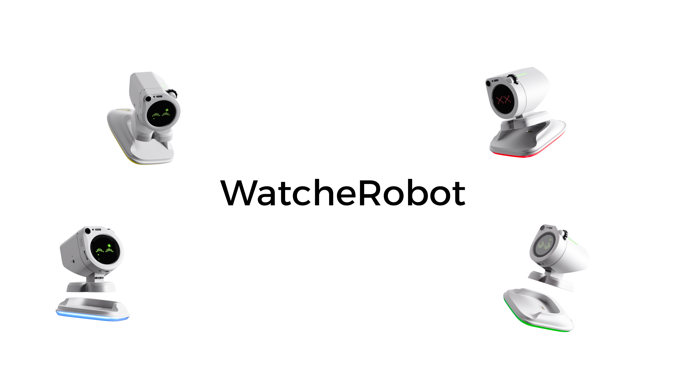

<div align="center">

<p><strong>English</strong> | <a href="README_zh.md">简体中文</a></p>



<p>Public materials for the WatcheRobot desktop robot, including hardware files, mechanical models, the Python SDK, flashing tools, user documentation, and Release asset notes.</p>

<p>
  <a href="LICENSE"></a>
  
  
  
  
</p>

</div>

---

## Overview

WatcheRobot is a desktop robot kit for companion interaction, interactive demos, and developer experiments. The full device is built around SenseCAP Watcher, an ESP32-S3, an STM32F103 co-processor, custom PCBs, mechanical parts, and SD-card behavior assets.

This repository publishes WatcheRobot public materials and developer-facing integration entrypoints; it does not contain the complete product source code. It includes hardware manufacturing files, editable PCB projects, mechanical assembly models, the Python SDK, flashing tools, network setup notes, user manuals, and Release asset documentation. ESP32-S3 and STM32F103 firmware is distributed as prebuilt Release assets, and firmware source code is not published in this repository.

Users can use these materials to check device assembly, flash firmware, configure networking, validate first startup, and build host-side integrations through the Python SDK. The SDK connects to WatcheRobot from a host computer and can use the camera, microphone, speaker, built-in expressions, and animation effects. For interfaces and examples, see the [Python SDK documentation](python-sdk/README.md).

## Quick Start

This section helps you get the public materials, prepare tools, and complete the smallest verifiable device startup and SDK connection flow.

### 1. Get the Repository

```bash
git clone --recurse-submodules https://github.com/orulink-ai/WatcheRobot-public.git
cd WatcheRobot-public
```

If the repository was cloned without submodules, run `git submodule update --init --recursive` before using `python-sdk/`.

### 2. Prepare the Environment

| Purpose | Required environment |
| --- | --- |
| Download | A browser |
| ESP32-S3 + Himax PTL flashing | Python 3.10+, CH342 driver, a data-capable USB cable, and the paired package's `requirements.txt` |
| STM32F103 flashing | ST-LINK or a compatible SWD probe, target power, and OpenOCD or another compatible flashing tool |
| SD card preparation | A FAT32-formatted SD card, card reader, and a tool that can extract `.tar.gz` archives |
| Desktop app | Windows x64 or an Apple Silicon Mac |
| Mobile app | Android for the APK; iOS with TestFlight for the iOS build |
| Python SDK | CPython 3.10, 3.11, or 3.12 and `pip` |

### 3. Download the current Release

Open [GitHub Releases](https://github.com/orulink-ai/WatcheRobot-public/releases), select the release marked **Latest**, and use only the assets attached to that release.

| Component | How to identify the asset |
| --- | --- |
| ESP32-S3 + Himax PTL firmware | ZIP with `S3` and `PTL-paired` in its name |
| STM32F103 firmware | ZIP with `STM32` in its name |
| Device SD card resources | `.tar.gz` archive with `sd-resources` in its name |
| Windows desktop app | x64 setup `.exe` |
| macOS desktop app | Apple Silicon `.dmg` |
| Android app | `.apk` |
| iOS app | [Install with TestFlight](https://testflight.apple.com/join/XFCFsm5M) |
| Python SDK | `watcherobot` `.whl` |

Choose the files by the component versions listed on the Release page. No manual checksum step is required. See [Downloads](docs/downloads.md).

### 4. Prepare the Robot in Order

1. Prepare the boards, components, and mechanical parts, then complete assembly. See the [OSHW project](https://oshwhub.com/team_efhmhuqf/project_gbxcghnl) and the local [hardware package](hardware/README.md).
2. Keep power off and check polarity, cable orientation, connectors, and possible shorts.
3. Use ST-LINK/SWD to flash STM32F103 on the feedback-servo control board inside the robot body.
4. Connect the Watcher head by USB. Follow the [flashing guide](docs/flashing.md) to create the Python environment and run the command that flashes Himax followed by ESP32-S3.
5. Remove the Watcher head's SD card and connect it to the computer with a card reader. Format it as FAT32, extract the `sd-resources` archive to the card root, safely eject it, and insert it while the robot is powered off. The head's USB connection cannot be used to write the SD card.
6. Reconnect the assembled hardware, power on, and run the first-start validation.

Detailed commands and hardware requirements are in [Firmware: Flashing and Assets](firmware/README.md#flashing-and-assets).

For AI-assisted PTL flashing, the Skill is already inside the extracted paired ZIP. Open the extracted package in an AI coding assistant and ask it to read `skills/watche-ptl-release-flash/SKILL.md`. Separate ESP32-S3, Himax, and Skill packages are not required.

### 5. Install a Client or the SDK

- Windows x64: run the x64 setup `.exe` from the current Release.
- Apple Silicon macOS: open the `.dmg` from the current Release and install the app.
- Android: install the `.apk` from the current Release; allow installation from the selected source if Android requests it.
- iOS: use the TestFlight entry in the asset table above.
- Python: follow [SDK setup and commands](docs/sdk.md) to create an environment, install the wheel, and connect the robot.

### 6. Run First-Start Validation

Use the [first-start validation checklist](docs/action-test.md) to check:

- ESP32-S3 boot logs
- SD-card asset recognition
- one basic servo or actuator action
- one LED or display behavior
- basic status returned from serial, BLE, WebSocket, or SDK entrypoints

After these checks pass, the smallest hardware, firmware, and resource chain is working.

## Repository Layout

```text
firmware/
  README.md       Firmware Release assets, flashing entry, and resource notes

hardware/
  README.md       Hardware package map and BOM notes
  pcb/            PCB source, schematics, layout PDFs, Gerber, BOM, CPL files, and spare-parts template
  3d-models/      Mechanical model exports
  assembly/       Assembly images or documents when available

python-sdk/        Git submodule containing Python SDK source, examples, and tests

docs/
  flashing.md             Firmware flashing and tool guide
  manuals/                Device network setup and full user manual PDFs
  sd-card-assets.md       SD-card behavior asset guide
  behavior-flash-skill.md Behavior asset checklist
  action-test.md          First-start validation checklist
  sdk.md                  SDK and public interface boundary
  versions.md             Version source-of-truth guide
  downloads.md            Release asset guide
  compatibility.md        Version compatibility matrix
  governance.md           Repository boundary notes

tools/
  ...             Flashing, release, and resource helper tools
```

## Project Documentation

- [Firmware and flashing notes](firmware/README.md)
- [Flashing tool guide](docs/flashing.md)
- [SD-card behavior assets](docs/sd-card-assets.md)
- [Behavior asset field checklist](docs/behavior-flash-skill.md)
- [First-start validation](docs/action-test.md)
- For device network setup, see the [device network setup guide](docs/manuals/device-network-setup.pdf).
- For the complete usage guide, see the [WatcheRobot user manual](docs/manuals/WatcheRobot-user-manual-20260724.pdf).
- [SDK and public interface boundary](docs/sdk.md)
- [Python SDK](python-sdk/README.md)
- [Version tracking](docs/versions.md)
- [Security policy](SECURITY.md)

## Public Scope

Open in this repository:

- Python SDK source
- PCB and mechanical publication files
- firmware flashing, resource preparation, and release helper tools
- user manuals, network setup guide, and release documentation

Not published as source in this repository:

- ESP32-S3 firmware source
- STM32F103 firmware source
- Android app source
- server source
- desktop app source

Distributed through GitHub Releases when available:

- ESP32-S3 prebuilt firmware
- STM32F103 prebuilt firmware
- SD-card asset package
- Android app package
- desktop app installer
- Python SDK wheel
- manifest and checksum files

The iOS app is distributed through TestFlight rather than as a Release attachment.

See [docs/downloads.md](docs/downloads.md) for the expected release asset types and current release status.

## Tech Stack

| Area | Main Contents |
| --- | --- |
| Python SDK | Python package, examples, host-side tests |
| Hardware | EasyEDA Pro, Gerber, BOM, CPL, STEP |
| Firmware assets | ESP32-S3 and STM32F103 prebuilt Release packages |
| Flashing tools | Python, Windows helper scripts, AI flashing skill |

## License

This repository is licensed under [GPL-3.0](LICENSE), unless a subproject or third-party component states otherwise in its own license file.
