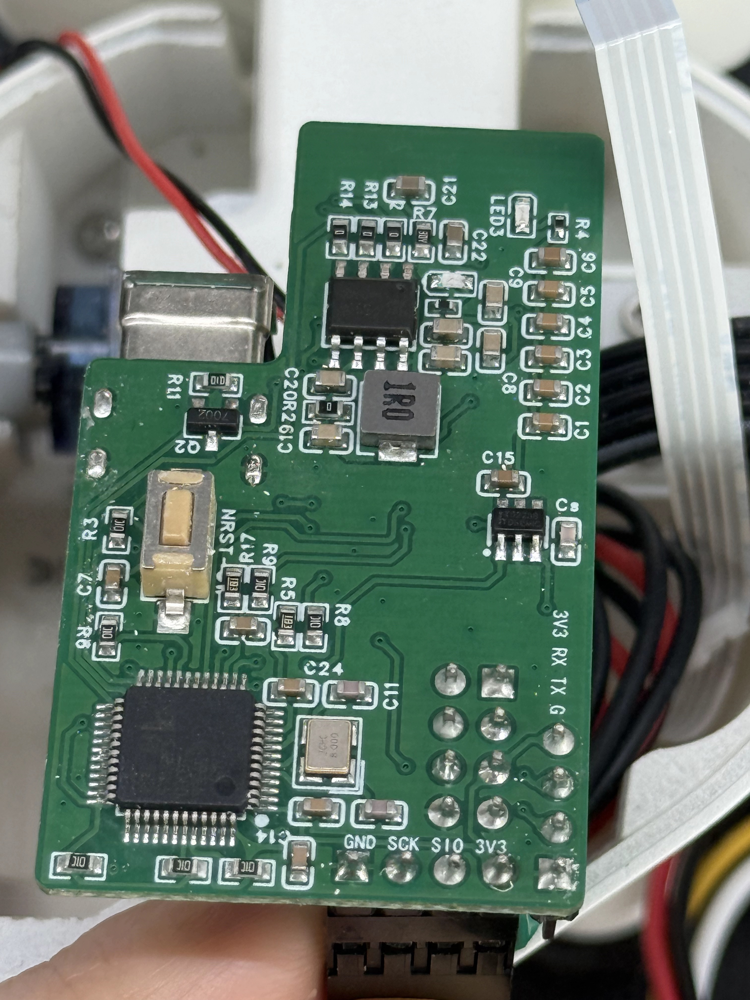
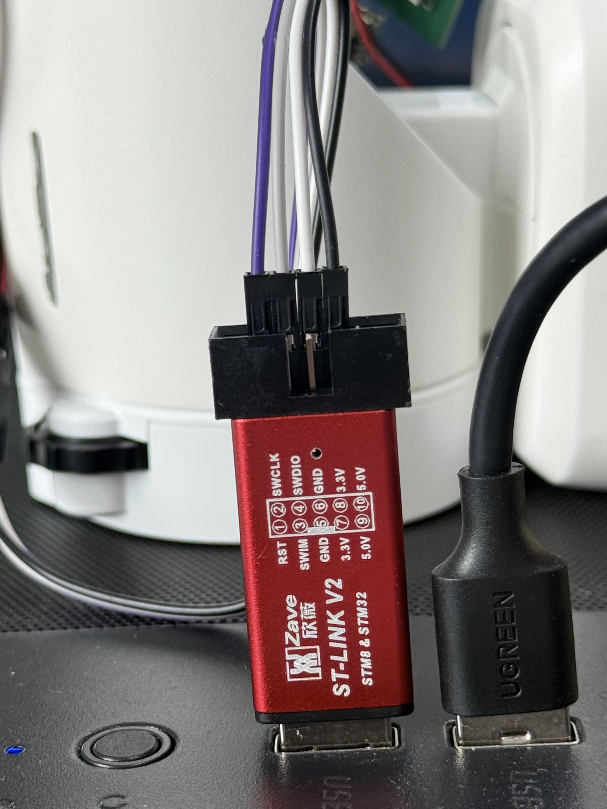

English | [简体中文](flashing_zh.md)

# Flashing and First Use

See the [OSHW project](https://oshwhub.com/team_efhmhuqf/project_gbxcghnl) for parts and assembly. Once hardware is ready, follow the steps below.

## 1. Prepare Materials, Files, and Environment

Have the STM32 body board, Watcher head, ST-LINK V2, USB data cable, SD card, and card reader ready. Disconnect power before changing wiring or inserting/removing the SD card.

Download and extract these assets from the [Latest Release](https://github.com/orulink-ai/WatcheRobot-public/releases/latest):

| Asset name contains | Purpose |
| --- | --- |
| STM32 | Body board firmware |
| PTL-paired | Head Himax and ESP32-S3 firmware and paired tools |
| sd-resources | SD card expressions, actions, and other resources |

Use Conda, or install [Miniconda](https://docs.conda.io/projects/miniconda/en/latest/) first. Open a Conda-enabled terminal at the repository root (Anaconda PowerShell Prompt on Windows). Create the dedicated environment once:

```sh
conda create -n watcherobot python=3.12 pip -y
conda activate watcherobot
```

Run the following commands at the repository root, replacing firmware paths with the extracted folders. The script prepares dependencies and flashing tools; initial setup requires internet access.

## 2. Flash the STM32 Body Board

Connect ST-LINK V2 to the four-pin connector on the board inside the body. Follow the labels, not wire colors.




| Body board | ST-LINK V2 |
| --- | --- |
| SIO | SWDIO |
| SCK | SWCLK |
| GND | GND |
| 3V3 | 3.3V, subject to the actual power arrangement |

Never connect 5V to 3V3. Do not parallel the ST-LINK 3.3V power output with an externally powered board. Check wiring and power, then connect ST-LINK to the computer.

Windows:

```powershell
powershell -NoProfile -ExecutionPolicy Bypass -File tools/flash.ps1 stm32 --package "extracted-STM32-folder"
```

macOS/Linux:

```sh
bash tools/flash.sh stm32 --package "extracted-STM32-folder"
```

Wait for `Programming Finished`, `Verified OK`, and `Resetting Target` with successful completion. Disconnect power and remove ST-LINK before continuing. If the chip cannot be reached, disconnect power and check wiring at both ends.

## 3. Flash Head Himax and ESP32-S3

Connect the Watcher head with a USB data cable. First run this command to install dependencies and list ports; it does not write firmware:

```powershell
powershell -NoProfile -ExecutionPolicy Bypass -File tools/flash.ps1 head --package "extracted-PTL-paired-folder"
```

Identify two ports on the same CH342 device: SERIAL-B / MI_02 is control; SERIAL-A / MI_00 is Himax. Do not guess from COM number order. Replace COM5 and COM6 below with the actual ports:

```powershell
powershell -NoProfile -ExecutionPolicy Bypass -File tools/flash.ps1 head --package "extracted-PTL-paired-folder" --port COM5 --vision-port COM6
```

On macOS/Linux use the same arguments with `bash tools/flash.sh` and actual `/dev/...` port paths.

The script flashes Himax first, then ESP32-S3; no separate commands are needed. After `HX flash completed; reboot accepted.`, keep waiting until `PTL paired flash completed.` confirms the whole step. Do not unplug the cable during flashing.

Stop if ports are missing or inaccessible: automatic CH342 driver installation and Linux serial permission setup are not yet supported.

## 4. Prepare the SD Card with a Card Reader

Power off, remove the card, and connect it through a card reader. Back up needed files, use a FAT32 card, and extract the SD resource archive into its root. The root must directly contain `assets/`, `official_catalog.json`, and `resource_manifest.json`, without an extra enclosing folder. Safely eject it and reinsert it with power off.

Do not write the SD card through the robot's USB connection. No flashing script is needed—only extract and copy files.

## 5. Power On and Use

Check the SD card and wiring, connect power, and press the power button. Check that the normal screen appears; the automatic reset after flashing may retain the powered-off state. Download Desktop or Android installers from the Release; use its TestFlight link for iOS. Python users can follow the [SDK Guide](sdk.md).

After connecting, try an expression, a light effect, and a movement within a safe range.

## Use the Skill (Optional)

Open this repository in an AI coding assistant and ask:

> Read skills/watche-release-flash/SKILL.md, use the dedicated Conda environment, confirm the firmware folder and connected target, then flash and report the actual result.

Without an AI assistant, simply use the commands above.
