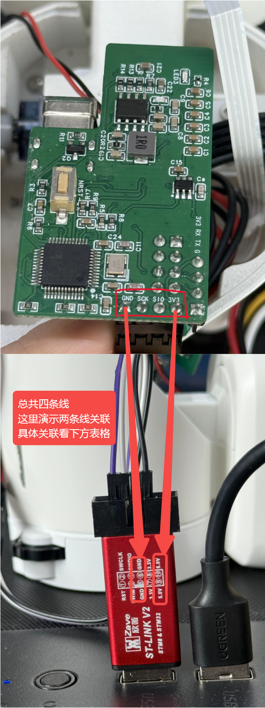

[English](flashing.md) | 简体中文

# 烧录与首次使用

材料清单和组装方法见[立创项目](https://oshwhub.com/team_efhmhuqf/project_gbxcghnl)。准备好硬件后，按以下步骤操作。

## 1. 准备材料、文件和环境

准备身体 STM32 主板、Watcher 头部、ST-LINK V2、USB 数据线、SD 卡和读卡器。接线、插拔 SD 卡前先断电。

从 [Latest Release](https://github.com/orulink-ai/WatcheRobot-public/releases/latest) 下载并解压：

| 附件名称包含 | 用途 |
| --- | --- |
| STM32 | 身体主板固件 |
| PTL-paired | 头部 Himax 和 ESP32-S3 固件及配套工具 |
| sd-resources | SD 卡表情、动作等资源 |

使用已安装的 Conda；没有时先安装 [Miniconda](https://docs.conda.io/projects/miniconda/en/latest/)。在仓库根目录打开支持 Conda 的终端（Windows 可用 Anaconda PowerShell Prompt），只需创建一次专用环境：

```sh
conda create -n watcherobot python=3.12 pip -y
conda activate watcherobot
```

在仓库根目录运行以下命令，将固件路径替换为实际解压目录。依赖和烧录工具由脚本自动准备，首次运行需联网。

## 2. 烧录身体主板 STM32

用 ST-LINK V2 连接身体内部主板的四针接口，按印字对应，不按线色猜。



| 身体主板 | ST-LINK V2 |
| --- | --- |
| SIO | SWDIO |
| SCK | SWCLK |
| GND | GND |
| 3V3 | 3.3V，按实际供电方式确认 |

不要将 5V 接入 3V3；主板外部供电时，不要并接 ST-LINK 的 3.3V 电源输出。检查接线和供电后，将 ST-LINK 插入电脑。

Windows：

```powershell
powershell -NoProfile -ExecutionPolicy Bypass -File tools/flash.ps1 stm32 --package "解压后的STM32目录"
```

macOS/Linux：

```sh
bash tools/flash.sh stm32 --package "解压后的STM32目录"
```

依次看到 `Programming Finished`、`Verified OK`、`Resetting Target` 且成功结束后，断电移除 ST-LINK，再继续下一步。若连不上芯片，先断电核对两端接线。

## 3. 烧录头部 Himax 和 ESP32-S3

用 USB 数据线连接 Watcher 头部。先运行以下命令，脚本安装依赖并列出串口；此命令不写入固件：

Windows：

```powershell
powershell -NoProfile -ExecutionPolicy Bypass -File tools/flash.ps1 head --package "解压后的PTL-paired目录"
```

macOS/Linux：

```sh
bash tools/flash.sh head --package "解压后的PTL-paired目录"
```

在上一步输出中确认 SERIAL-B 和 SERIAL-A 对应的端口。Windows 的 `desc:` 名称与参数对应如下，以 COM61、COM62 为例：

| 设备名称 | 端口（示例） | 命令参数 |
| --- | --- | --- |
| USB-Enhanced-SERIAL-B CH342（ESP32） | COM61 | `--port COM61` |
| USB-Enhanced-SERIAL-A CH342（Himax） | COM62 | `--vision-port COM62` |

也可在 Windows「设备管理器 → 端口（COM 和 LPT）」查看名称后括号中的 COM 号。只连接一台待烧录的 Watcher。

`--port` 填 SERIAL-B 的端口，`--vision-port` 填 SERIAL-A 的端口。将下面两处端口号替换为实际值后运行：

```powershell
powershell -NoProfile -ExecutionPolicy Bypass -File tools/flash.ps1 head --package "解压后的PTL-paired目录" --port COM61 --vision-port COM62
```

macOS/Linux 完整烧录命令：

```sh
bash tools/flash.sh head --package "解压后的PTL-paired目录" --port "/dev/SERIAL_B" --vision-port "/dev/SERIAL_A"
```

`/dev/SERIAL_B` 和 `/dev/SERIAL_A` 是占位路径，分别替换成查询到的 ESP32 和 Himax 串口路径；不要按端口数字大小判断。无法确认对应关系时，先不要烧录。

脚本先烧 Himax，再烧 ESP32-S3，不需要分开操作。看到 `HX flash completed; reboot accepted.` 后继续等待，直到 `PTL paired flash completed.` 才算整步完成，期间不要拔线。

若串口未出现或无法访问，先停止：当前脚本尚不能自动处理 CH342 驱动和 Linux 串口权限。

## 4. 用读卡器准备 SD 卡

用读卡器将 FAT32 格式的 SD 卡连接电脑，把 SD 资源压缩包解压到卡的根目录，再插回头部。根目录内容见 [SD 卡资源说明](sd-card-assets_zh.md)。

## 5. 上电并使用

确认 SD 卡和接线就位，接通电源并按电源键开机，检查屏幕进入正常界面。烧录后的自动复位不一定会解除关机状态。从 Release 下载 Desktop 或 Android 安装包；iOS 使用页面中的 TestFlight。Python 用户见 [SDK 指南](sdk_zh.md)。

连接后按[首次运行检查](action-test_zh.md)尝试一个表情、灯效和安全范围内的动作。

## 使用 Skill（可选）

用 AI 编程助手打开本仓库，告诉它：

> 读取 skills/watche-release-flash/SKILL_zh.md，使用已创建的专用 Conda 环境，确认固件目录和连接设备后执行烧录，报告真实结果。

不使用 AI 助手时，按上面的命令操作即可。
